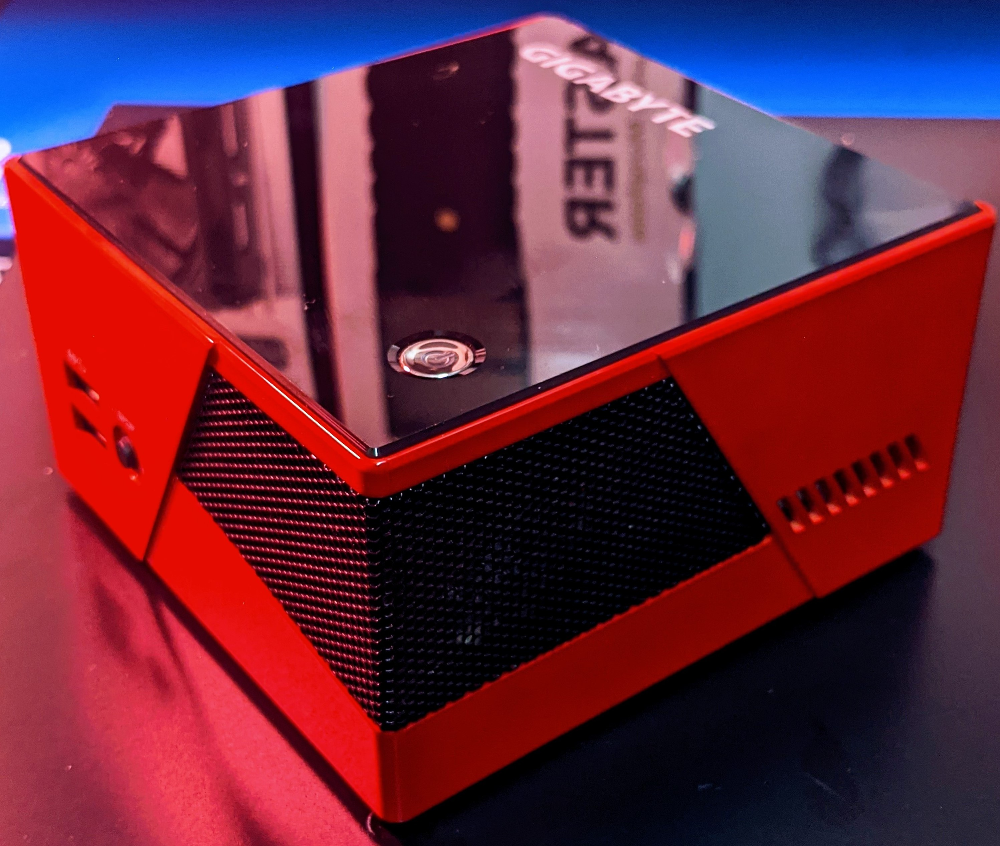
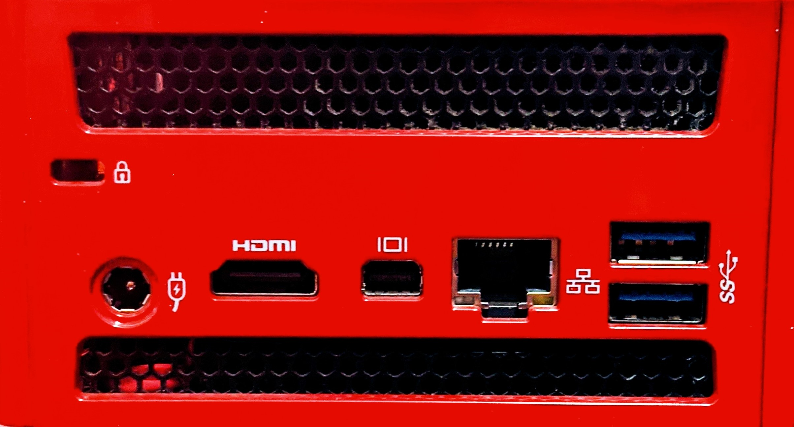

---
title: "Brix Kvm Server"
date: 2021-01-27T06:30:57-05:00
toc: false
images:
tags:
  - linux
  - homelab
---
### With Ubuntu Server LTS 20.04


---
***Getting my realtek nic to work***

---

When I was deleting Debian Buster on my brix machine, I tried to save as many notes and config files for future reference. Anything that would help me remember how to set up KVM from scratch again. There was this little folder called rt0xxxx or something. 'Huh', I thought... looks like some kind of realtek driver. Well, it was. A little voice tried to tell me that I spent a hella time scouring blogs trying to get my ethernet port to work and this was the fix. 'Nah, I don't need it' I said. *please see the name of this blog*

I spent literally hours trying to figure out why my /etc/network/interfaces file would not work. It showed me having an ip address but I couldn't ping anything at all. DNS I thought, so I updated the resolv.conf file, nope. I got lost in Ubuntu's new netplan method thinking that had something to do with it. I uninstalled Network-Manager. The whole time I failed to realize that during the install process I never had network connectivity and I just assumed that if it installed I had networking. That is not the case because it merely installed from USB and I thought it was connecting during install then breaking afterwards.

Thanks to a blog called tuxbyte, which just might be what I used last time, I was able to get the realtk nic to work correctly.

["How To get your Realtek RTL8111/RTL8168 working"](https://tuxbyte.com/how-to-get-your-realtek-rtl8111rtl8168-working-updated-guide/)


```bash
#!-- make sure packages are up to date
sudo apt update
#!-- this is the answer!
sudo apt install r8168-dkms
#!-- blacklist the old driver just in case
sudo sh -c 'echo blacklist r8169 >> /etc/modprobe.d/blacklist.conf'
```

---
***Getting my wifi driver to work***

---

Again with the sh*tty realtek drivers! Very annoying but this is the process to get it running. I want to have wifi available in case I have problems with that ethernet NIC again I will at least have networking. I had an issue with not being able to bring up the interface and after careful investigation I realized the driver I was using was not up to par, once again.

Using this git repo ["abperiasamy/rtl8812AU_8821AU_linux"](https://github.com/abperiasamy/rtl8812AU_8821AU_linux)

```bash
#!-- clone the repo
git clone https://github.com/abperiasamy/rtl8812AU_8821AU_linux.git
#!-- change to the new directory
cd rtl8812AU_8821AU_linux/
#!-- run this last simple command
sudo make -f Makefile.dkms install
```
I rebooted and the driver was recognized and the interface was up and netplan connected to my wifi,.. hooray!


---
***Installing Packages***

---


```bash
#!-- I did this package 1st but I think it installs with nfs-common
sudo apt install libnfs-utils
#!-- to access my nfs shares
sudo apt install nfs-common
#!-- to access samba mounts
sudo apt install cifs-utils
```
