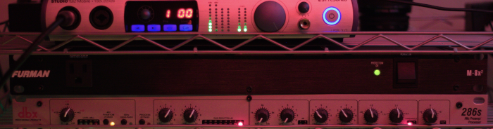
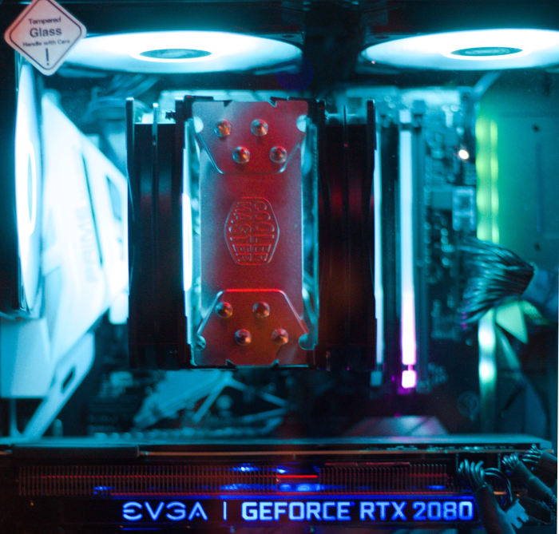

This is my 'exhaustive' gear list. I will hopefully update this page regularly to include every major and minor little obscure piece of gear I own. Often times people ask me about a thing I use but I can't remember for the life of me the name of it let alone a link to it. Like for instance my fethed or the exact mic stand I use. Please peruse and enjoy!! :)

[*!!Amazon Affiliate Links!!*](#note) *-a note*

## Game PC
---

- MB: [Asus Prime Z370-A](https://amzn.to/38wwjkw)
- CPU: [Intel 8700K](https://amzn.to/38w02Kz)
- GPU: [EVGA RTX 2080 BLACK](https://amzn.to/2MOwLSN)
- *links are funky, here is the UPC for my gpu 08G-P4-2081-KR*
- PSU: [EVGA SUPERNOVA 650 G3 Gold](https://amzn.to/38yRmmM)
- RAM: [16 GB Corsair Vengeance RGB 3200](https://amzn.to/39nCvuA)
- HD: [1 TB Samsung 970 EVO Plus M.2 NVMe](https://amzn.to/2MVtcKP)
- Cooler: [Hyper 212 EVO](https://amzn.to/2XwI04E)
- Case: [Montech AIR 900 MESH Black](https://amzn.to/3bvcqfI)
- Fans: [DeepCool RF120M](https://amzn.to/3ovn6P4) x 8
---
- Monitor 01 [Acer XFA240 144hz](https://amzn.to/3i53u24)
- Monitor 02 [BenQ GW2480 60hz](https://amzn.to/3sp92Js)
- Monitor 03 [BenQ GW2480 60hz](https://amzn.to/3sp92Js)

---

## Stream PC
---

- MB [Asus TUFF Gamming X570-Plus-WiFi](https://amzn.to/3nBsyyu)
- CPU [AMD 3900X](https://amzn.to/39h3N5K)
- GPU [EVGA GTX 1060 SC](https://amzn.to/2MVPdJt)
- PSU [EVGA SUPERNOVA 850 T2](https://amzn.to/3nDWudj)
- RAM [32G Vengeance 3000](https://amzn.to/2XwJ6gI)
- HD1 [1TB 860 EVO m.2 SATA](https://amzn.to/2XsqZIO)
- HD2 [1TB 970 EVO m.2 NVMe](https://amzn.to/3ny18cX)
- HD3 [WD 2tb HDD](https://amzn.to/3siK0f4)
- HD4 [HGST 4tb HDD](https://amzn.to/3qgw17H)
- HD5 [256G WD Passport USB3.1](https://amzn.to/2XvdyI3)
- Cooler [Noctua NHD15 Chromax](https://amzn.to/3nvpHr7)
- Case [Garbage Can](https://amzn.to/2LpTaWn)
- *a.k.a. DeepCool Tesseract #dontbuy
---
- Monitor 01 [AOC 144hz](https://amzn.to/3ntszok)
- *AOC 2460G4 144hz 24inch*

## Peripherals
---

- KeyBoard [Corsair K70 RGB MK.2 lowpro](https://amzn.to/3bv3EOE)
- Main Mouse [Logitec G502](https://amzn.to/2LeZQXr)
- 2nd Mouse [Razer Death Ader Elite](https://amzn.to/3oA6cz1)
---
- [Stream Deck](https://amzn.to/35wTFVj)
- [Korg NanoKontrol2](https://amzn.to/39h8UTu)

## Audio
---

- mic [Rode Procaster](https://amzn.to/3spzvXk)
- shock mount [Rode PSM1](https://amzn.to/39qAde0)
- stand [InnoGear](https://amzn.to/3qaaXzr)
- Channel Strip [DBX 286s](https://amzn.to/38zcedt)
- interface [PreSonus Studio 192 Mobile](https://amzn.to/2XsAEPD)
- preamp activator [fethead](https://amzn.to/3oCEMs5)
- cables [Mogami Sliver 25ft XLR](https://amzn.to/3s9HUOt)
- Ground Loop Isolator [Pyle Mini Hum Elliminator](https://amzn.to/35rR4fm)
- power conditioner [Furman M-8X2](https://amzn.to/2Lf2IDH)
---
- Main Head Phones [MassDrop AKG K7XX](https://amzn.to/35vHdW5)
- alt. Head Phones [Audio Technica AD700](https://amzn.to/3buHzjp)
- Headphone Amp: [Fosi Audio Q4](https://amzn.to/3sipbA7)

## Video
---

- [Sony A6400](https://amzn.to/35yNOiu)
- lens ... [Sigma 16mm 1.4](https://amzn.to/3sc8GFQ)
- [Gopro Hero5 Black](https://amzn.to/2MLzpZw)
- [Logitec C270](https://amzn.to/3nD7mIu)
- Old Camera [Canon Rebel t2i](https://amzn.to/3bAzhGV)
- Capture Card [Camlink](https://amzn.to/3qfsHJX)

## Lighting
---

- [Phillips Hue Bulb](https://amzn.to/3oGBBQo)
- [Phillips Hue Strip](https://amzn.to/3scQtbb)
- [GVM Ring Light](https://amzn.to/3oz6iH6)
- [USB LED lights](https://amzn.to/3nx8q0x)

---

### About Amazon Affiliate Links: ### {#note}

My friend, I am obligated to tell you that clicking on any of the links above, provides me with the possibility of monetizing your little click-itie click-ities! You see [Jeff Bezos](https://en.wikipedia.org/wiki/Jeff_Bezos) is the richest man in the known universe. They say that [Elon Musk](https://en.wikipedia.org/wiki/Elon_Musk) is the richest but when the Martians invade they will surely kill Elon first, but Bezos will be able to distract the Martians by educating them about his Amazon Prime feature. Which will no doubt keep them busy shopping online.

What this all means is that [Jeff Bezos](https://en.wikipedia.org/wiki/Jeff_Bezos) has a lot of shiny pennies. If you click a link on this page and eventually buy the product, Jeff,... will pull out one of his shiny pennies and start shaving some penny dust - which will fall on his boot. Then he will look down at my lowly self and instruct me to lick his boot if I want my shiny penny dust. If I do this enough I can eventually defecate an entire penny! =D So if you would not be so offended in helping me on my quest,.. I thank you for your kind patronage!
